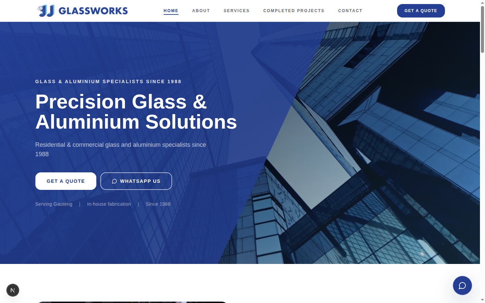
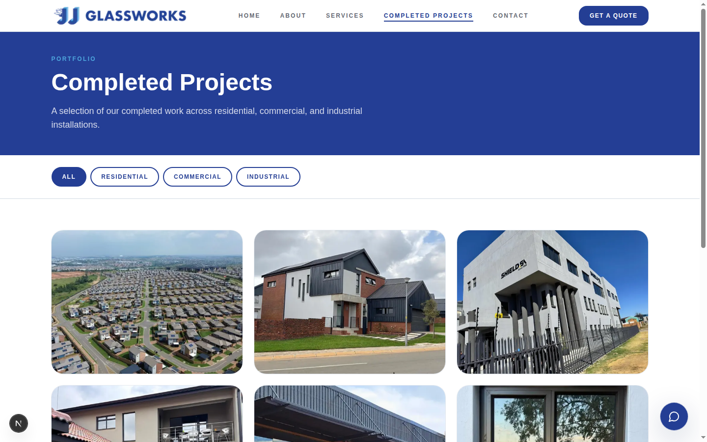
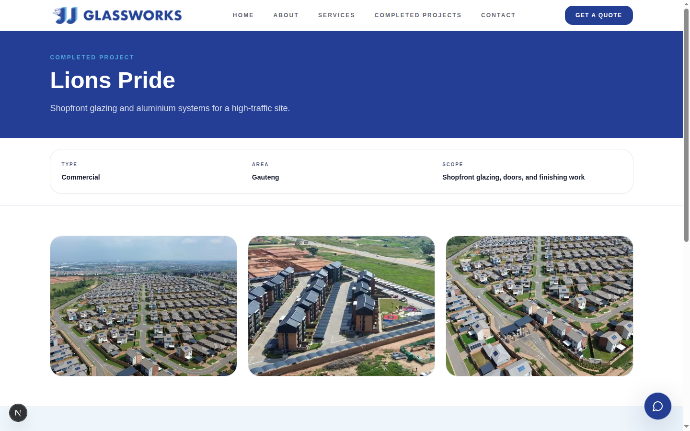
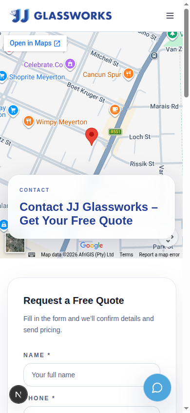

# JJ Glassworks — Marketing Website

A production marketing website for JJ Glassworks, a family-owned glass and aluminium
fabrication business operating in Gauteng, South Africa since 1988.

## Overview

JJ Glassworks fabricates and installs aluminium windows, doors, shopfronts, shower
glass, balustrades, and custom-cut glass for residential, commercial, and industrial
clients. This site is their public-facing website: it presents the business, its
services, and a portfolio of completed projects, and gives prospective customers a way
to request a quote.

## The Problem

The business relies on word of mouth and repeat commercial clients, but had no proper
web presence to support that — no way for a prospective customer to see the range of
services offered, review completed work, or reach the business without picking up the
phone during office hours.

## The Solution

A fast, content-focused Next.js site that covers the core paths a prospective customer
or existing commercial client needs: what services are offered, examples of completed
work by category (residential, commercial, industrial), who the team is, and several
direct ways to make contact (WhatsApp, phone, email, or a quote request form).

## Key Features

- **Service pages** — detailed breakdowns of each service line (aluminium windows,
  doors, shopfronts, shower/bathroom glass, cut-to-size glass, putty repairs and
  glazing), each with its own imagery and specifics.
- **Completed projects gallery** — a filterable portfolio (`/completed-projects`)
  covering commercial and industrial case studies, plus a dedicated residential
  before/after section. `/gallery` permanently redirects here.
- **About / team page** — company history, a group photo, and a team directory with
  direct contact details for key staff.
- **Contact page** — an embedded Google Maps location, direct WhatsApp/phone/email
  links, business hours, and a multi-service quote request form.
- **Persistent mobile call-to-action** and floating WhatsApp button for fast contact
  on mobile, where most of this business's traffic originates.
- Responsive, accessible layout with `next/image` throughout (remote images served
  from Cloudinary) and semantic markup for SEO.

## Tech Stack

- **Framework:** Next.js 16 (App Router, Turbopack, React 18, TypeScript)
- **Styling:** Tailwind CSS, `class-variance-authority` for component variants,
  `tailwind-merge` / `clsx` for class composition
- **Icons:** lucide-react
- **Images:** Cloudinary (remote), optimized via `next/image`
- **Linting:** ESLint with `eslint-config-next`

## Architecture

This is a static-first Next.js App Router site — there is no backend, database, or
authentication layer. Content (service descriptions, completed-project data, team
contacts) is defined directly in TypeScript modules under `lib/`, and pages are
statically generated at build time.

```
app/                    Route segments (App Router)
  about/                Company + team page
  completed-projects/   Portfolio, including a dynamic [slug] project detail route
  contact/              Quote form + contact details
  gallery/              Redirects to /completed-projects
  services/             Service catalogue
components/             Page sections and shared UI primitives
  ui/                   Small reusable primitives (button, card, input, select, textarea)
lib/                    Static content and helpers (completed-projects.ts, team.ts, utils.ts)
```

## Engineering Highlights

- **Static generation with a dynamic detail route** — completed projects are defined
  as typed data (`lib/completed-projects.ts`) and rendered through a shared
  `[slug]` route plus a reusable project template component, rather than duplicating
  markup per case study.
- **Type-safe content model** — a discriminated union (`BusinessProject` vs.
  `ResidentialHighlightsProject`) lets one gallery system render two meaningfully
  different layouts (case-study cards vs. before/after sections) from the same data
  source without runtime branching in the UI.
- **Image handling** — all photography is served from Cloudinary and rendered through
  `next/image`, with `remotePatterns` locked to the project's own Cloudinary account.
- **Small, composable UI layer** — lightweight `components/ui` primitives (variant
  helpers rather than a full component library) keep styling consistent without
  pulling in unnecessary dependencies.

## Screenshots

### Home



### Completed projects gallery



### Project detail



### Mobile



A services-page capture is also in `docs/screenshots/`.

## Running Locally

Requires Node.js 20.9+ (see `.nvmrc`) — Next.js 16 does not support Node 18.

```bash
npm install
npm run dev            # http://localhost:3000
```

Other scripts:

```bash
npm run dev:turbopack  # dev server with Turbopack
npm run build           # production build
npm run start            # serve the production build
npm run lint              # ESLint
```

This project currently has no required environment variables — all content is static
or pulled from the public Cloudinary CDN. If environment-specific configuration is
added later, document the variable names (not values) in an `.env.example` file.

## Testing / Quality

- **TypeScript:** `npx tsc --noEmit`
- **Lint:** `npm run lint` (ESLint via `eslint-config-next`, enforced during
  `npm run build`)
- **Build:** `npm run build`

There is no automated test suite at this time.

## Deployment

Deployed on Netlify (zero-config Next.js support). Netlify's build image must use
Node.js 20.9+ — this is pinned via `.nvmrc` and `package.json` `engines`, since
Next.js 16 requires it and some Netlify build images still default to Node 18.
No environment secrets are required for the build.

## What I Built

I audited, secured, and cleaned up this repository for production and portfolio
presentation: patched a critical Next.js RCE and then upgraded through to Next.js 16
(verifying Netlify/Node compatibility before doing so and pinning the required Node
version), introduced a working ESLint configuration (previously absent, with lint
silently skipped during builds), removed dead code and unused assets, resolved a
conflicting package-manager lockfile that was breaking production builds, and
tightened `.gitignore` coverage. Feature development on the site itself (the pages,
components, and content described above) was built iteratively prior to this audit;
this pass focused on hardening and presentation rather than rewriting working
functionality.
